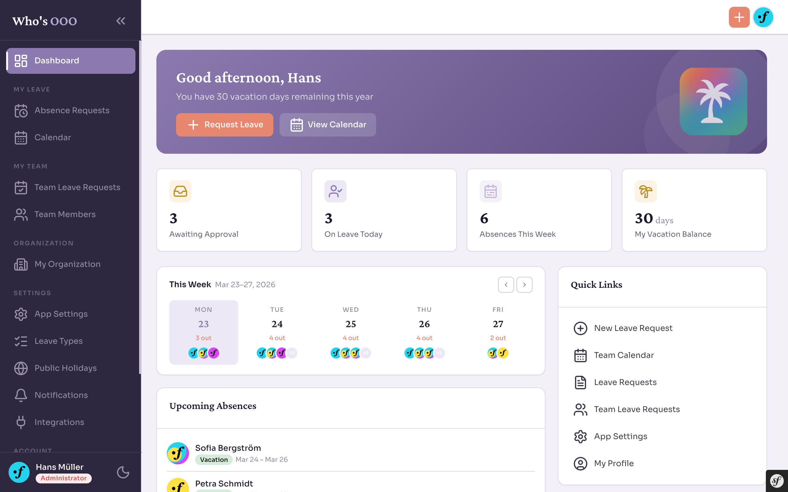

# Who's Out of Office

[](https://github.com/igornast/who-is-out-of-office/actions/workflows/php.yml)
[](https://codecov.io/gh/igornast/who-is-out-of-office)


A self-hosted staff leave planner built with Symfony 7.4. Manage leave requests, team calendars, public holidays, and Slack notifications — all in one place.

**[www.whoisooo.app](https://www.whoisooo.app)**



**Features:**
- Leave request workflow with approval/rejection
- Role-based access — Admin, Manager, Employee
- Slack integration — in-channel approvals and weekly digest
- Public holiday calendars with regional subdivision support
- iCal feed export per user
- Email notifications

## 🚀 Quick Start

```bash
git clone https://github.com/igornast/who-is-out-of-office.git
cd who-is-out-of-office
just start
```

The PHP container handles everything on first boot: installs dependencies, waits for the database, runs migrations, and loads dev fixtures.

The app is available at **`http://localhost/app/dashboard`**.

For full setup details and how to run tests, see [CONTRIBUTING.md](CONTRIBUTING.md).

## 🛠️ Admin Account

The dev fixtures include a default admin account for initial access:

- **Email:** `admin@whoisooo.app`
- **Password:** `123`

> ⚠️ **Important:** This account is only available in development (fixtures are never loaded in production).
> Create your own admin account before going live.


## ⚙️ Application Settings

The application uses a YAML-based settings system that allows administrators to configure application behavior without code changes.

**Available Settings:**
- `auto_approve` - Enable/disable automatic approval of leave requests
- `auto_approve_delay` - Delay in seconds before automatically approving leave requests

**Managing Settings:**
1. Log in with an admin account
2. Navigate to **App Settings** in the sidebar menu
3. Update settings and click **Save Changes**

Settings are stored in `app/src/Module/Settings/Config/app_setting.yaml` and can be relocated using the `APP_SETTINGS_FILE` environment variable.

📖 **[Read the detailed Settings documentation](app/src/Module/Settings/README.md)** for architecture details, adding new settings, and advanced configuration.

## 📅 Public Holiday Import

Public holidays can be imported via the admin UI:

1. Log in with an admin account
2. Navigate to **Public Holidays** in the Settings sidebar section
3. Click **Add Calendar**, select a country and year, then import

Alternatively, use the CLI command:

```shell
php app/bin/console app:holiday:import DE Germany 2025
```

## 🗂️ Frontend & Assets
The project uses Symfony AssetMapper and Symfony UX for JavaScript, CSS, and components.

After deployment, compile the assets:

```shell
php app/bin/console asset-map:compile
```

Side notes:
* Assets live in `assets/` and importmap.php. 
* Remote packages (e.g. Stimulus, UX components) are resolved at compile time. 
* Do not edit files in `public/assets/` they are generated.

For details, see [AssetMapper](https://symfony.com/doc/current/frontend/asset_mapper.html) and [Symfony UX](https://ux.symfony.com).


## Slack Integration

This section describes how to integrate Slack notifications into the leave‑planner application.

---

### 1. Configuration

1. Make sure to define these environment variables in your `.env.local` or server environment:

```dotenv
###> symfony/notifier ###
SLACK_DSN=""
SLACK_SIGNING_SECRET=""
# Channel for absence request approval notifications
SLACK_AR_APPROVE_CHANNEL_ID=""
# Channel for the absences daily digest
SLACK_AR_HR_DIGEST_CHANNEL_ID=""
###< symfony/notifier ###
```

---

### 2. Sending Notifications

The app uses two channels to communicate with the company members.
* SLACK_AR_APPROVE_CHANNEL_ID - channel used for in-slack approval actions. Managers can approve or reject requests
  directly from the slack integration bot.
* SLACK_AR_HR_DIGEST_CHANNEL_ID - weekly digest with absences and birthdays information.
* 
---

### 3. Verifying Incoming Requests

The app uses `SLACK_SIGNING_SECRET` to verify if the incoming api messages has been sent by the absence bot app.
For more details on the implementation check `RequestVerifier` class in the slack module.

---

### 4. User‑Specific DMs

Once a user has configured their `slackMemberId`, and enabled the custom app. The bot can send them private updates.

---

### 5. Weekly Digest (Scheduled Task)

You can use weekly digest command to get summaries at a specific point in time. To trigger digestions 
run the `slack:weekly_digest` command, which you can use in cron and set the schedule to every Monday at 8 am.

Example: `0 8 * * MON php bin/console slack:weekly_digest`

The bot will post a summary of:

- Who is out this week.
- Birthdays for this week.
- Fallback message if no absences or birthdays.

---

### 6. Slack Bot Setup & Approval Workflow

1. **Install the Leave Planner Bot**
   - Create a new Slack App and add it to your workspace.
   - Generate an OAuth token and set `SLACK_DSN` to include it.
   - Grant the bot the `chat:write` scope.
   - Learn more about OAuth setup here: https://api.slack.com/authentication/oauth-v2

2. **Enable Interactivity**
   - In your Slack App settings, navigate to **Interactivity & Shortcuts**.
   - Set the **Request URL** to:
     ```
     https://your-domain.com/api/slack/interactive-endpoint
     ```

3. **Post Approval Requests**
   - Whenever someone submits a leave request, the bot will announce it in the approval channel.
   - The message includes **Approve** and **Reject** buttons for managers.

4. **Handle Button Clicks**
   - When a manager clicks **Approve** or **Reject**, Slack sends a `block_actions` payload to the interactive endpoint.
   - Leave Planner app:
      1. Verifies the Slack signature.
      2. Reads the action button `value`.
      3. Updates the leave request status in the system.
      4. Updates the original Slack message to reflect the outcome.

5. **Notify the Requester**
   If the user has provided a Slack member ID, the bot will send them a direct message with the updated request status.

---

### 7. Slack Status Auto-Sync

Automatically set a user's Slack status (emoji + text) when they are on approved leave, and clear it when the leave ends or is cancelled. This feature requires a **paid Slack workspace**.

#### How it works

A background command (`slack:sync-statuses`) runs every 30 minutes and:

- **Sets** the Slack status for users whose approved leave is currently active and hasn't been synced yet. The status shows the leave type name and end date (e.g. "Vacation until Apr 18") with a configurable emoji.
- **Clears** the Slack status for users whose leave has ended or is no longer approved (rejected, withdrawn).

The sync is idempotent — each leave request is tracked with an internal flag, so statuses are never set twice and the command safely catches up after downtime.

#### Prerequisites

- A **paid Slack workspace** (free plans do not allow setting another user's status).
- The Slack App must be configured with an **OAuth redirect URL** pointing to your instance.
- Each user must have their **Slack Member ID** linked in their profile settings.

#### Admin setup

1. Add these environment variables to `.env.local`:

   ```dotenv
   ###> app/slack-status-sync ###
   SLACK_CLIENT_ID="your-slack-app-client-id"
   SLACK_CLIENT_SECRET="your-slack-app-client-secret"
   SLACK_TOKEN_ENCRYPTION_KEY="base64-encoded-32-byte-key"
   ###< app/slack-status-sync ###
   ```

   To generate the encryption key, run:

   ```bash
   php -r "echo base64_encode(sodium_crypto_secretbox_keygen());"
   ```

   Copy the output and paste it as the `SLACK_TOKEN_ENCRYPTION_KEY` value. This key is used to encrypt the admin OAuth token at rest — keep it secret and do not rotate it without re-authorizing.

2. In your Slack App settings, add the OAuth redirect URL:
   ```
   https://your-domain.com/app/settings/slack-status-sync/oauth/callback
   ```

3. Add the `users.profile:write` **user scope** to your Slack App (under OAuth & Permissions > User Token Scopes).

   > **Important:** Adding a new scope requires reinstalling the Slack App to your workspace. This generates a new **Bot User OAuth Token**, so you must update the `SLACK_DSN` environment variable in production with the new token.

4. Log in as admin and go to **Settings > Integrations**.

5. Click **Authorize status sync** — you'll be redirected to Slack to grant permission. The admin account performing this step must be a **Slack workspace Owner or Admin**.

6. After authorization, the status shows as "Active" and the feature is live.

#### Configuring leave type emojis

Each leave type can have a custom Slack emoji code (e.g. `:palm_tree:`, `:face_with_thermometer:`). Set this in **Leave Request Types > Edit** via the "Slack status emoji" field. If left blank, the default `:calendar:` emoji is used.

#### User opt-out

Users can disable status sync for their account in **Profile Settings** — a toggle appears when the admin has authorized status sync and the user has linked their Slack Member ID.

#### Revoking access

An admin can revoke the status sync authorization at any time from **Settings > Slack Status Sync > Revoke**. This immediately disables the feature for all users. If the admin token becomes invalid (e.g. the authorizing user is removed from Slack), the app detects this automatically and disables the feature.

## Contributing

Contributions are welcome! See [CONTRIBUTING.md](CONTRIBUTING.md) for setup instructions, coding standards, and how to submit changes.

## License

[AGPL-3.0](LICENSE)
