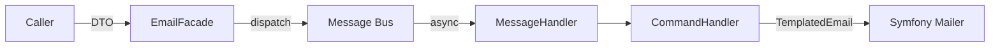
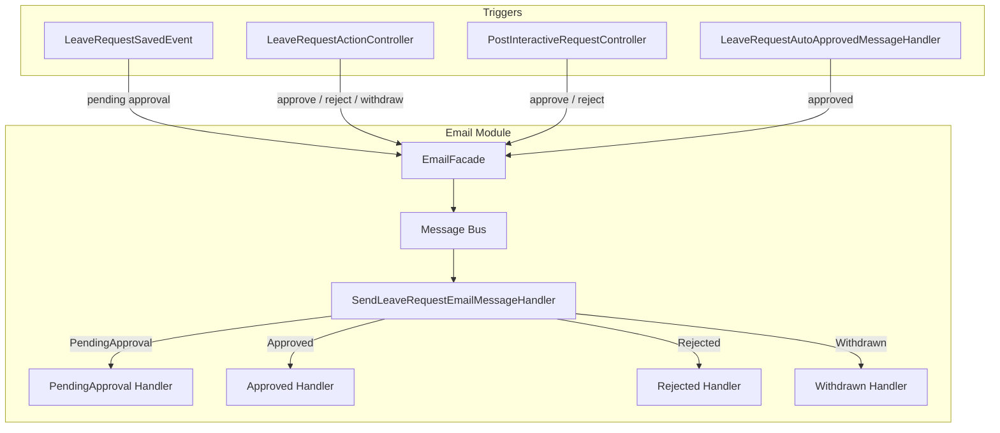

# Email Module

The Email infrastructure module handles all outbound email notifications using Symfony Mailer and Messenger. Emails are dispatched asynchronously via the message bus, ensuring non-blocking delivery.

## Architecture

```
Email/
├── EventListener/
│   └── LeaveRequestEmailListener.php          # Listens to LeaveRequestSavedEvent → pending approval email
├── Message/
│   ├── LeaveRequestEmailType.php              # Enum: PendingApproval, Approved, Rejected, Withdrawn
│   ├── SendLeaveRequestEmailMessage.php       # Messenger message for leave request emails
│   └── SendInvitationEmailMessage.php         # Messenger message for invitation emails
├── MessageHandler/
│   ├── SendLeaveRequestEmailMessageHandler.php # Routes to type-specific command handler
│   └── SendInvitationEmailMessageHandler.php   # Delegates to invitation command handler
├── UseCase/Command/
│   ├── SendInvitationEmailCommandHandler.php
│   ├── SendLeaveRequestPendingApprovalEmailCommandHandler.php
│   ├── SendLeaveRequestApprovedEmailCommandHandler.php
│   ├── SendLeaveRequestRejectedEmailCommandHandler.php
│   └── SendLeaveRequestWithdrawnEmailCommandHandler.php
├── template/                                   # Twig namespace: @AppEmail
│   ├── base.html.twig
│   ├── invitation.html.twig
│   ├── leave_request_pending_approval.html.twig
│   ├── leave_request_approved.html.twig
│   ├── leave_request_rejected.html.twig
│   └── leave_request_withdrawn.html.twig
├── EmailFacade.php                             # Facade implementation (final)
└── README.md
```

**Shared components:**
- `Shared/Facade/EmailFacadeInterface.php` — Facade interface

## Email Types

| Email | Recipient | Trigger |
|---|---|---|
| **Invitation** | New user | Admin creates a user via CRUD (`CreateInvitationForNewUserSubscriber`) |
| **Pending Approval** | Employee | New leave request submitted (`LeaveRequestSavedEvent`) |
| **Approved** | Employee | Manager approves via UI, Slack, or auto-approve |
| **Rejected** | Employee | Manager rejects via UI or Slack |
| **Withdrawn** | Employee | Employee withdraws their request via UI |

## Async Dispatch Flow

All emails are dispatched asynchronously through Symfony Messenger. The facade dispatches a message to the bus, which is consumed by workers in the background.



## Leave Request Email Flow

Leave request status changes trigger email notifications from multiple entry points. The facade provides a unified API, and the message handler routes to the correct command handler based on the email type.



## User Preference

Leave request emails respect the user's `isEmailNotificationsEnabled` setting. If disabled, the command handler returns early without sending. Invitation emails are always sent regardless of this setting.

## Environment Configuration

```dotenv
MAILER_DSN=smtp://localhost:1025
EMAIL_FROM_ADDRESS=noreply@example.com
EMAIL_FROM_NAME="Who's OOO"
```

## Templates

Templates use the Twig namespace `@AppEmail` (configured in `twig.yaml`). All templates extend `base.html.twig` which provides the email layout and styling.
